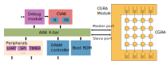
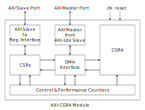
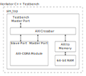
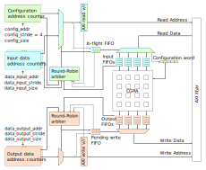
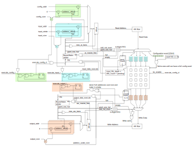

# Simulation Setup for the Development of a Module for Integration of the STRELA CGRA with an AXI Interface

## Requirements

- Verilator. Has been tested with version 5.020. Installation directory must be specified in the Makefile.
- GTKWave for waveform display.

## File structure

- rtl/axi_cgra_module_sim/:
    - SystemVerilog sources for a module for integration of the STRELA CGRA with an AXI Interface.
    - Testbench and other sources needed for simulation.

- rtl/cva6_files/: SystemVerilog packages with information useful for configuration of the crossbar used in the simulation of the AXI CGRA module. This crossbar has the same memory map as that of OpenHW's cva6 development platform.

- rtl/strela/: Sources for the STRELA CGRA in a 4x4, 32-bit, integer configuration.

- rtl/vendor/pulp-platform/: Third-party IP such as protocol adapters and FIFOs.

- Makefile: Orchestrates the simulation flow. Running `make waves` will call Verilator with the project sources, generate an executable model, run it and launch GTKWave with the simulation traces.

- gtkwave_config/: Configuration file for waveform visualization in GTKWave. Waveform configuration can be modified in GTKWave's GUI, and saved to a file, with which GTKWave is called by the Makefile.

- docs/figures/: Figures

## Figures and Block Diagrams
Here are some figures and block diagrams that are useful for understanding this repository. For further information, please refer to:

_Integration of a CGRA Accelerator with a CVA6 RISC-V Core for the Cloud-edge Continuum. Master Thesis. Juan Granja Garijo. Chapter 4 (2024)_

### CGRA Module and Simulation
|  |
|:-:|
|_The module simulated in this repository connected to the CVA6 development platform_|

|  |
|:-:|
|_Block diagram of the AXI CGRA Module_|

||
|:-:|
|_Block diagram of the simulation setup_|

### DMA Interface
||
|:-:|
|Simplified diagram of the DMA Interface, showing logic for reading and writing data. Logic for reading data is re-used to load CGRA's configuration.|

||
|:-:|
|Detailed diagram of the DMA Interface. The color coding of the simplified diagram is maintained.|

## Notes

This is a prototype. The implementation has not been optimized for timing and/or resource utilization.